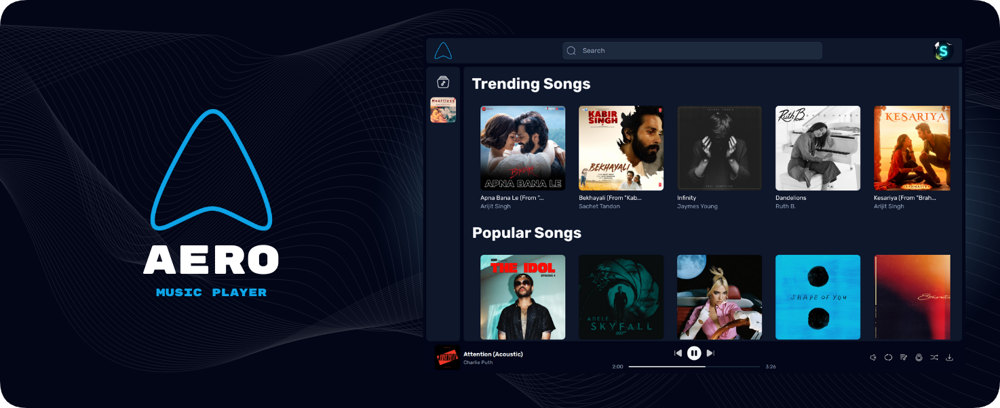
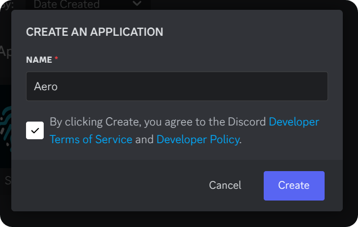
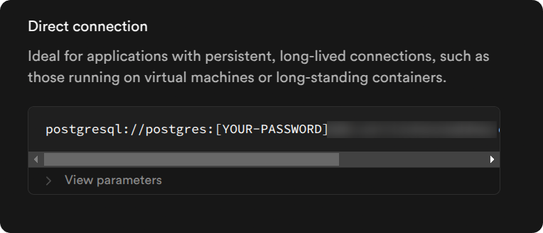
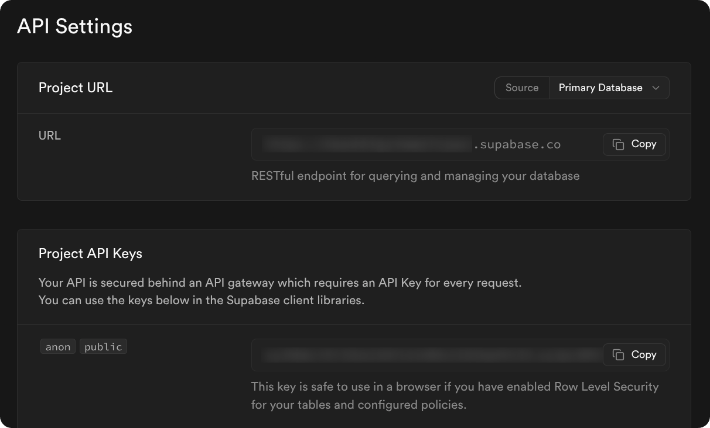
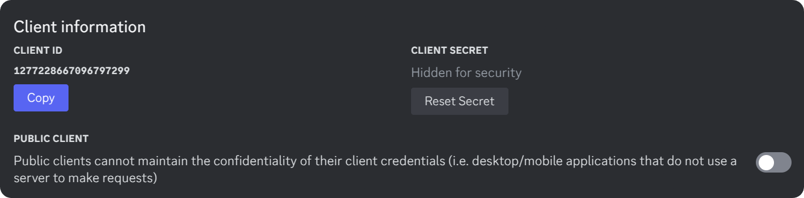
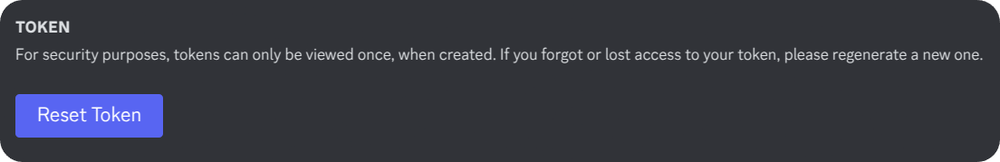
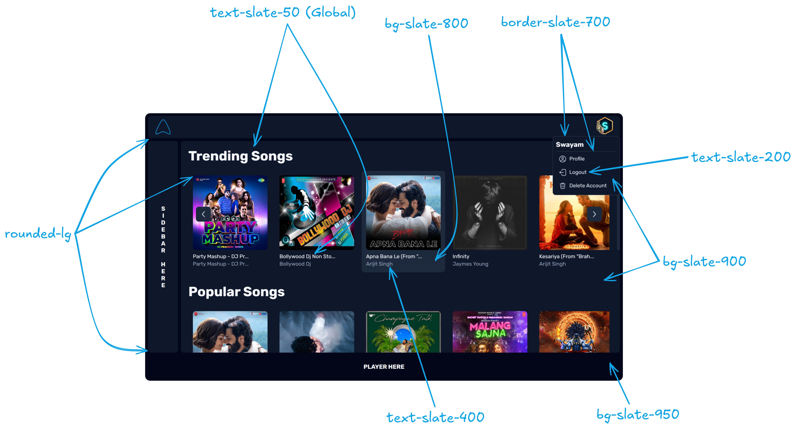

<div align="center">



Aero makes listening to music feel light and breezy

</div>

## 🚩 Installing

1. Clone this repository
    ```sh
    git clone https://github.com/swayam25/Aero aero
    cd aero
    ```

2. Install dependencies
    ```sh
    pnpm i
    ```

3. Create an application at the [Discord Developer Portal](https://discord.com/developers/applications).
    

4. Create `.env` file from `.env.example` in the root directory and fill in the required values.
    <details>

    <summary>ENV Vars</summary>

    - Get `DATABASE_URL` from Supabase.
        
    - Get `SUPABASE_URL` and `SUPABASE_KEY` from Supabase API Settings.
        
    - Get `JWT_SECRET` by running the following command.
        ```sh
        pnpm run gen-secret
        ```
    - Get `DISCORD_CLIENT_ID` and `DISCORD_CLIENT_SECRET` from the Discord Developer Portal.
        
    - Get `DISCORD_BOT_TOKEN` from the Discord Developer Portal.
        

    </details>

5. Add redirect url at the Discord Developer Portal.
    

6. Start the app
    ```sh
    pnpm run dev
    ```

## 🚀 Production

1. Follow steps 1-4 from the [installation](#-installing) section.

2. Build docker image
    ```sh
    docker build -t aero .
    ```

3. Run docker container
    ```sh
    docker run --name aero -d -p 3000:3000 -e ORIGIN="http://localhost:3000" aero
    ```

## ❤️ Contributing

- Things to keep in mind
    - Follow our commit message convention.
    - Write meaningful commit messages.
    - Keep the code clean and readable.
    - Make sure the app is working as expected.

- Code Formatting
    - Run `pnpm run format` before committing your changes or use [`Prettier`](https://prettier.io/) extension in your code editor.
    - Make sure to commit error free code. Run `pnpm run check` to check for any errors.

- CSS Style Guide (*Tailwind CSS*)
    
    - Primary Font Color: `slate-50` (*No need to add this explicitly, it is already added as global font color in [app.css](./src/app.css)*)
    - Secondary Font Color: `slate-200`
    - Tertiary Font Color: `slate-400`
    - Theme Color: `sky-500`
    - Primary Background Color: `slate-950` (*Globally added in [app.css](./src/app.css)*)
    - Secondary Background Color: `slate-900` (*For cards/containers*)
    - Tertiary Background Color: `slate-800` (*For cards/options on hover*)
    - Card/Container Background Color: `slate-900` (*For cards add `border-slate-700`*)
    - For other colors use `<color>-500` as text color and `<color>-500/10` as background color on hover (*make sure to have bg color as `slate-800`/`slate-900`/`slate-950` before hover*).
    - Rounded Corners: `rounded-lg` (*For every possible card/container*)
    - For buttons and links, we strictly use the [`<Button />`](./src/lib/components/Button.svelte) component.