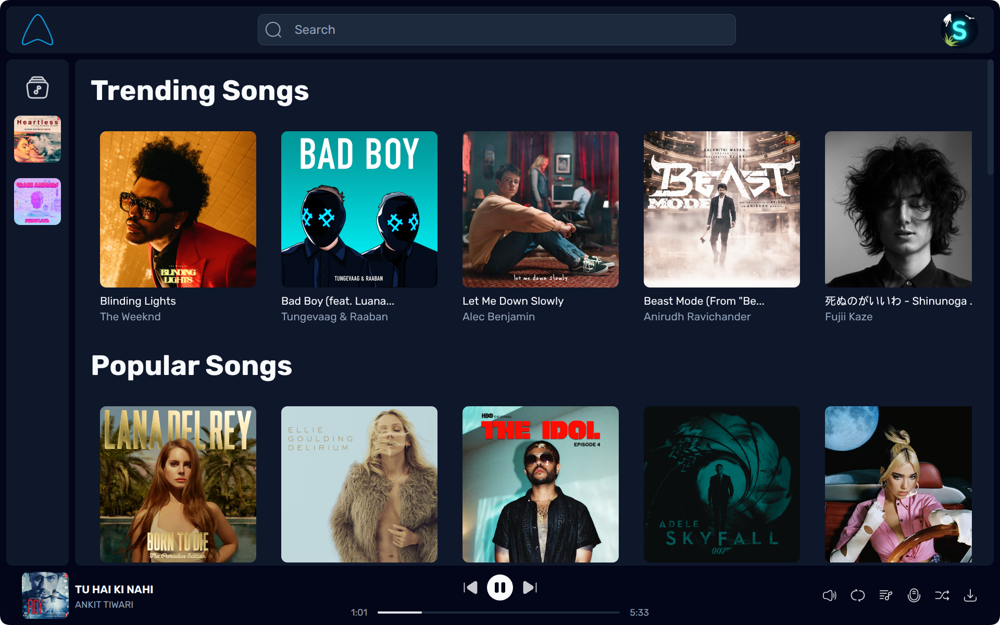
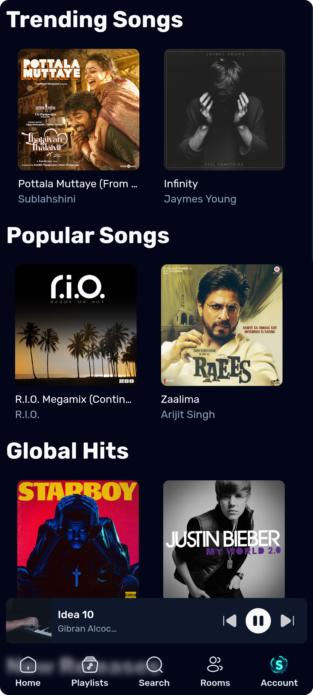
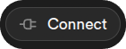
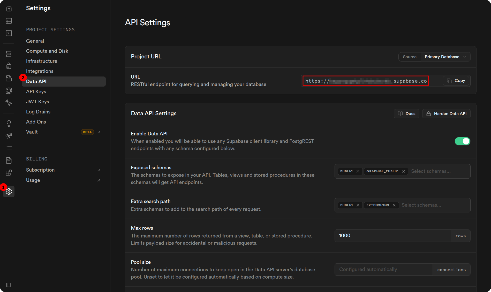
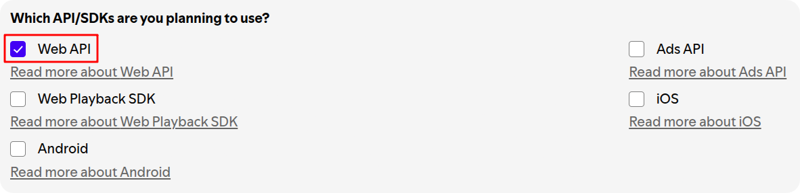
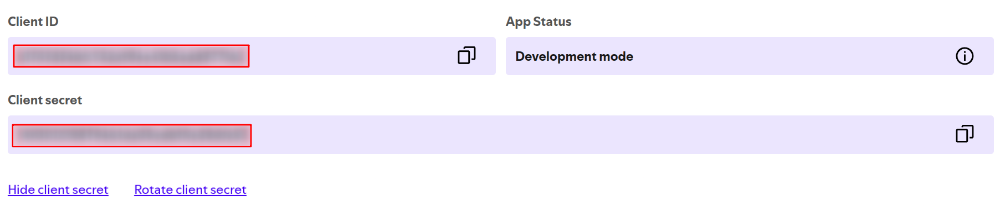
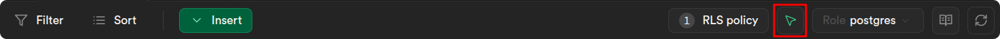

<div align="center">


# Aero

Aero makes listening to music feel light and breezy

[](https://svelte.dev/docs/svelte/overview)
[](https://tailwindcss.com)
[](https://supabase.com)
[](https://orm.drizzle.team)

</div>

## 📸 Preview

<details>

<summary>Desktop</summary>



</details>

<details>

<summary>Mobile</summary>

| Mobile Homepage                                      | Mobile Player                                        |
| ---------------------------------------------------- | ---------------------------------------------------- |
|  |  |

</details>

## 🚩 Installation

1. Clone this repository
    ```sh
    git clone https://github.com/swayam25/Aero aero
    cd aero
    ```

2. Install dependencies
    ```sh
    pnpm i
    ```

3. Create an application at the [Discord Developer Portal](https://discord.com/developers/applications).
    

4. Create `.env` file from `.env.example` in the root directory and fill in the required values.
    <details>

    <summary>ENV Vars</summary>

    - Get `DATABASE_URL` from Supabase. Click on the  button at the top bar.
        
    - Get `VITE_SUPABASE_URL` and `VITE_SUPABASE_KEY` from Supabase API Settings.
        
        
    - Get `JWT_SECRET` by running the following command.
        ```sh
        pnpm run gen-secret
        ```
    - Get `DISCORD_CLIENT_ID` and `DISCORD_CLIENT_SECRET` from the Discord Developer Portal.
        
    - Get `DISCORD_BOT_TOKEN` from the Discord Developer Portal.
        
    - Get `SPOTIFY_CLIENT_ID` and `SPOTIFY_CLIENT_SECRET` from the [Spotify Developer Dashboard](https://developer.spotify.com/dashboard/applications).
        - Create a new application and fill in the required details.
        - Set Redirect URI to `http://localhost` (*we don't need it, but Spotify requires it to be set*).
        - Select the API scopes required for the app.
            
        - Copy the Client ID and Client Secret.
            
    - Set `YOUTUBE_DL_PATH` to the path of `youtube-dl` or `yt-dlp` executable. You can install it from [GitHub Releases](https://github.com/yt-dlp/yt-dlp/releases) (`yt-dlp`) or use a package manager.
    - Set `DOMAIN` to your domain name or `http://localhost:3000` for local development. The variable is required for production.
        ```env
        DOMAIN="https://your-domain.com"
        ```
    </details>

5. Add redirect url at the Discord Developer Portal.
    

6. Push the database schema to Supabase.
    ```sh
    pnpm run db:push
    ```

7. Navigate to **Table Editor** in Supabase Dashboard and enable **RLS** for all the tables.

8. Navigate to **Authentication** > **Policies** in Supabase Dashboard and create policies for all the tables.
    

9. Navigate to **Table Editor** in Supabase Dashboard and enable **Realtime** for `playlist`, `room` & `room_member` table.
    

> [!NOTE]
> Check the [Supabase Docs](https://supabase.com/docs/guides/realtime/postgres-changes) for more information on enabling Realtime.

10. Start the app
    ```sh
    pnpm run dev
    ```

## 🚀 Production

1. Follow steps 1-9 from the [installation](#-installation) section.

2. Change `DOMAIN` in `.env` file to your domain name.
    ```env
    DOMAIN="https://your-domain.com"
    ```

> [!IMPORTANT]
> `DOMAIN` is the URL you will use to access the app.
> This dynamically sets `ORIGIN` during `node build` and configure the Caddy server's domain (*for the reverse proxy*).
> For local development, you can set it to `http://localhost:3000`.
> Ensure this matches the Redirect URL in the Discord Developer Portal (*see step 5 in the [installation](#-installation) section*).
>
> Check the [SvelteKit Docs](https://svelte.dev/docs/kit/adapter-node#Environment-variables) for more information about the `ORIGIN` variable.

1. Run docker container (*via `docker compose`*)
    ```sh
    docker compose up -d
    ```

## ❤️ Contributing

- Things to keep in mind
    - Follow our commit message convention.
    - Write meaningful commit messages.
    - Keep the code clean and readable.
    - Make sure the app is working as expected.

- Code Formatting
    - Run `pnpm run format` before committing your changes or use [`Prettier`](https://prettier.io/) extension in your code editor.
    - Make sure to commit error free code. Run `pnpm run check` to check for any errors.

- Check [STYLES.MD](./STYLES.MD) for the CSS style guide.
