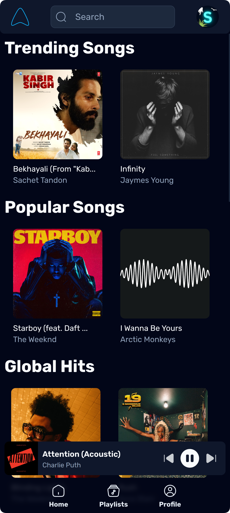

<div align="center">


# Aero

Aero makes listening to music feel light and breezy

[](https://svelte.dev/docs/svelte/overview)
[](https://tailwindcss.com)
[](https://supabase.com)
[](https://orm.drizzle.team)

</div>

## 📸 Preview

<details>

<summary>Desktop</summary>


</details>

<details>

<summary>Mobile</summary>

| Mobile Homepage                                      | Mobile Player                                        |
| ---------------------------------------------------- | ---------------------------------------------------- |
|  |  |

</details>

## 💫 Prerequisites

### 🧰 Tools

| Tool                                                                                                                                    | Type                     | Version | Purpose                                                |
| --------------------------------------------------------------------------------------------------------------------------------------- | ------------------------ | ------- | ------------------------------------------------------ |
| [](https://www.docker.com/) | Required                 | 20.10+  | To deploy the app using containerization.              |
| [](https://git-scm.com/)             | Required                 | 2.50+   | To clone the repository and manage version control.    |
| [](https://nodejs.org/)  | Optional (*Development*) | 24+     | To run the app locally and contribute to the codebase. |
| [](https://pnpm.io/)              | Optional (*Development*) | 10.20+  | To manage project dependencies efficiently.            |

### 🧲 VPS Specs

| Component | Minimum Requirement | Recommended Requirement |
| --------- | ------------------- | ----------------------- |
| CPU       | 2 vCPU              | 4 vCPU or more          |
| RAM       | 4 GB                | 8 GB or more            |
| Storage   | 10 GB               | 20 GB                   |
| Network   | 100 Mbps            | 1 Gbps or more          |

## 🚀 Production

1. Clone the repository

   ```sh
   git clone https://github.com/swayam25/Aero aero
   cd aero
   ```

2. Create an application at the [Discord Developer Portal](https://discord.com/developers/applications).
    

3. Create `.env` file from the provided `.env.example` and fill in the required environment variables.
    ```sh
    cp .env.example .env
    ```
> [!TIP]
> Check [environment variables](#-environment-variables) section for details on the environment variables.

4. Add redirect url at the Discord Developer Portal.
    

5. Push the database schema to Supabase.
    ```sh
    pnpm run db:push
    ```

6. Navigate to **Table Editor** in Supabase Dashboard and enable **RLS** for all the tables.

7. Navigate to **Authentication** > **Policies** in Supabase Dashboard and create policies for all the tables.
    

8. Navigate to **Table Editor** in Supabase Dashboard and enable **Realtime** for `playlist`, `room` & `room_member` table.
    

> [!NOTE]
> Check the [Supabase Docs](https://supabase.com/docs/guides/realtime/postgres-changes) for more information on enabling Realtime.

9. Docker compose
   ```sh
   docker compose up -d
   ```

## 🛸 Development

1. Follow first 8 steps from the [production](#-production) section.

2. Install dependencies
   ```sh
   pnpm i
   ```

3. Start the development server
   ```sh
   pnpm run dev
   ```

## 🔑 Environment Variables

| Variable                | Type     | Description                                              |
| ----------------------- | -------- | -------------------------------------------------------- |
| `PUBLIC_DISCORD_URL`    | `string` | Discord API base URI                                     |
| `DATABASE_URL`          | `string` | Supabase connection string                               |
| `VITE_SUPABASE_URL`     | `string` | Supabase project URL                                     |
| `VITE_SUPABASE_KEY`     | `string` | Supabase API Key                                         |
| `JWT_SECRET`            | `string` | JWT secret                                               |
| `DISCORD_CLIENT_ID`     | `string` | Discord client ID                                        |
| `DISCORD_CLIENT_SECRET` | `string` | Discord client secret                                    |
| `DISCORD_BOT_TOKEN`     | `string` | Discord bot token                                        |
| `SPOTIFY_CLIENT_ID`     | `string` | Spotify client ID                                        |
| `SPOTIFY_CLIENT_SECRET` | `string` | Spotify client secret                                    |
| `YOUTUBE_DL_PATH`       | `string` | Path to `youtube-dl`/`yt-dlp` binary                     |
| `DOMAIN`                | `string` | Your domain for the reverse proxy, also used as `ORIGIN` |

### 📚 Getting database keys

- Create a supabase project
    

- Get `DATABASE_URL` from Supabase. Click on the  button at the top bar.
    

- Get `VITE_SUPABASE_URL` and `VITE_SUPABASE_KEY` from Supabase API Settings.
    | `VITE_SUPABASE_URL`                  | `VITE_SUPABASE_KEY`                                       |
    | ------------------------------------ | --------------------------------------------------------- |
    |  |  |

### 🔮 Getting Discord OAuth keys

- Get `DISCORD_CLIENT_ID` and `DISCORD_CLIENT_SECRET` from the Discord Developer Portal.
        

- Get `DISCORD_BOT_TOKEN` from the Discord Developer Portal.
    

### 🎷 Getting Spotify API keys

- Get `SPOTIFY_CLIENT_ID` and `SPOTIFY_CLIENT_SECRET` from the [Spotify Developer Dashboard](https://developer.spotify.com/dashboard/applications).
    - Create a new application and fill in the required details.
    - Set Redirect URI to `http://localhost` (*we don't need it, but Spotify requires it to be set*).
    - Select the API scopes required for the app.
        
    - Copy the Client ID and Client Secret.
        

### 🪇 Other keys

- Generate `JWT_SECRET` by running the following command.
    ```sh
    pnpm run gen-secret
    ```

### 🌏 Setting domain

- Set `DOMAIN` to your domain name. *The variable is required only in production.*
    ```env
    DOMAIN="https://<your-domain>.com"
    ```

> [!IMPORTANT]
> `DOMAIN` is the URL you will use to access the app.
> This dynamically sets `ORIGIN` during deployment and configures the Caddy server's domain (*for the reverse proxy*).
> 
> Ensure that the domain name matches the Redirect URL in the Discord Developer Portal (*see step 4 of the [production](#-production) section*).
>
> Check the [SvelteKit Docs](https://svelte.dev/docs/kit/adapter-node#Environment-variables) for more information about the `ORIGIN` variable.

## ❤️ Contributing

- Things to keep in mind
    - Follow our commit message convention.
    - Write meaningful commit messages.
    - Keep the code clean and readable.
    - Make sure the app is working as expected.

- Code Formatting
    - Run `pnpm run format` before committing your changes or use [`Prettier`](https://prettier.io/) extension in your code editor.
    - Make sure to commit error free code. Run `pnpm run check` to check for any errors.

- Check [STYLES.md](./STYLES.md) for the CSS style guide.